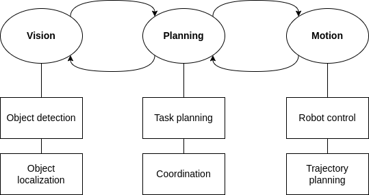

<p align='center'>
    <h1 align="center">Vision-Based Lego Detection, Localization, and Assembly
Using UR5 Robot</h1>
    <p align="center">
    Robotic project at University of Trento
    </p>
    <p align='center'>
    Anh Tu Duong<br>
    anhtu.duong@studenti.unitn.it
    </p>   
</p>

<div align="center">


</div>

### Table of Contents
- [Project Description](#project-description)
- [Installation](#installation)
- [Run UR5LegoVision](#run-ur5Legovision)
- [Conclusion](#conclusion)


# Project Description
UR5LegoVision is a robotic project that performs pick-and-place tasks using a UR5 robot arm equipped with a ZED camera for perception. The goal of the project is to achieve autonomous assembly of "lego-like" Mega Bloks by detecting, localizing, and manipulating the blocks using the robot arm.


The methodology is structured around the implementation of three ROS (Robot Operating System) nodes representing the core components of the system:



## Vision
The Vision component serves as the perception module of the robot and is responsible for detecting and localizing the "lego-like" Mega Bloks using a ZED camera. The workflow of the Vision component involves dataset collection, YOLO training for object detection, and point cloud generation from 3D Lego models. Point cloud registration techniques are used to align the point clouds of the detected objects with their 3D models, obtaining the translation and orientation information of the blocks.

## Motion
The Motion component is responsible for trajectory planning and robot arm manipulation. It utilizes the MoveIt package, a motion planning framework in ROS, to calculate feasible trajectories for the UR5 robot arm based on the target poses and orientations provided by the Planning component. The robot arm then executes these trajectories to pick up the detected Lego blocks and place them in their designated positions.

## Planning
The Planning component is yet to be fully developed, and it poses the primary challenge in the project. It involves high-level coordination and task planning, integrating information from the Vision and Motion components. The Planning component will generate a high-level plan for the robot arm, considering factors such as the availability of Lego blocks, sequence of pick-and-place operations, and error handling.

📌 [See full documentation](https://github.com/anhtuduong/UR5LegoVision/blob/main/docs/report.pdf)

---
  
# Installation
To set up the UR5LegoVision project, follow these steps:

## Install locosim:

Locosim is a didactic framework to learn/test basic controllers schemes on quadruped robots (HyQ/Solo/Aliengo/Go1 are supported) and manipulators (UR5 is supported). Locosim in this project has been customized to cater to specific needs and requirements. For the original Locosim framework, please refer to the following [link!](https://github.com/mfocchi/locosim)

Locosim is composed by a **roscontrol** node called **ros_impedance_controller** (written in C++) that interfaces a python ROS node (where the controller is written) to a Gazebo simulator.

#### SOFTWARE VERSIONS:

Locosim is compatible with Ubuntu 16/18/20. The installation instructions have been generalized accordingly. You need replace four strings (PYTHON_PREFIX, PYTHON_VERSION, PIP_PREFIX, ROS_VERSION) with the appropriate values according to your operating systems as follows:

| **Ubuntu 20**:               | Ubuntu 18:                   | **Ubuntu 16**:               |
| ---------------------------- | ---------------------------- | ---------------------------- |
| PYTHON_PREFIX = python3      | PYTHON_PREFIX = python3      | PYTHON_PREFIX = python       |
| PYTHON_VERSION = 3.8         | PYTHON_VERSION = 3.5         | PYTHON_VERSION = 2.7         |
| ROBOTPKG_PYTHON_VERSION=py38 | ROBOTPKG_PYTHON_VERSION=py35 | ROBOTPKG_PYTHON_VERSION=py27 |
| PIP_PREFIX = pip3            | PIP_PREFIX = pip3            | PIP_PREFIX = pip             |
| ROS_VERSION = noetic         | ROS_VERSION = bionic         | ROS_VERSION = kinetic        |

**NOTE:** ROS is no longer supported on Ubuntu 22 (only ROS2) hence is not possible to install Locosim on Ubuntu 22.

### Install ROS 

setup your source list:

```
sudo sh -c 'echo "deb http://packages.ros.org/ros/ubuntu $(lsb_release -sc) main" > /etc/apt/sources.list.d/ros-latest.list'
```

Set up your keys:

```
curl -sSL 'http://keyserver.ubuntu.com/pks/lookup?op=get&search=0xC1CF6E31E6BADE8868B172B4F42ED6FBAB17C654' | sudo apt-key add -
```

install ROS main distro:

```
sudo apt-get install ros-ROS_VERSION-desktop-full
```

install ROS packages:

```
sudo apt-get install ros-ROS_VERSION-urdfdom-py
```

```
sudo apt-get install ros-ROS_VERSION-srdfdom
```

```
sudo apt-get install ros-ROS_VERSION-joint-state-publisher
```

```
sudo apt-get install ros-ROS_VERSION-joint-state-publisher-gui
```

```
sudo apt-get install ros-ROS_VERSION-joint-state-controller 
```

```
sudo apt-get install ros-ROS_VERSION-gazebo-msgs
```

```
sudo apt-get install ros-ROS_VERSION-control-toolbox
```

```
sudo apt-get install ros-ROS_VERSION-gazebo-ros
```

```
sudo apt-get install ros-ROS_VERSION-controller-manager
```

```
sudo apt install ros-ROS_VERSION-joint-trajectory-controller
```

### Support for Realsense camera (simulation)

This packages are needed if you want to see the PointCloud published by a realsense camera attached at the end-effector. To activate it, you should load the xacro of the ur5 with the flag "vision_sensor:=true". 

```
sudo apt-get install ros-ROS_VERSION-openni2-launch
```

```
sudo apt-get install ros-ROS_VERSION-openni2-camera
```

```
sudo apt install ros-ROS_VERSION-realsense2-description
```

### Support to simulate Grasping

Unfortunately grasping in Gazebo is still an open issue, I impelented grasping using this [plugin]( https://github.com/JenniferBuehler/gazebo-pkgs/wiki/Installation) that creates a fixed link between the gripper and the object to be grasped. To activate the grasping plugin set gripper_sim parameter to True in your configuration file. The following dependencies are required:

```
sudo apt-get install ros-ROS_VERSION-eigen-conversions 
```

```
sudo apt-get install ros-ROS_VERSION-object-recognition-msgs
```

```
sudo apt install ros-ROS_VERSION-roslint
```

You can check which parameters have to be tuned looking to the following [wiki]( https://github-wiki-see.page/m/JenniferBuehler/gazebo-pkgs/wiki/The-Gazebo-grasp-fix-plugin) 


### Pinocchio

Add robotpkg as source repository to apt:

```
sudo sh -c "echo 'deb [arch=amd64] http://robotpkg.openrobots.org/packages/debian/pub $(lsb_release -sc) robotpkg' >> /etc/apt/sources.list.d/robotpkg.list"
```

```
sudo sh -c "echo 'deb [arch=amd64] http://robotpkg.openrobots.org/wip/packages/debian/pub $(lsb_release -sc) robotpkg' >> /etc/apt/sources.list.d/robotpkg.list"
```

Register the authentication certificate of robotpkg:

```
sudo apt install -qqy lsb-release gnupg2 curl
```

```
curl http://robotpkg.openrobots.org/packages/debian/robotpkg.key | sudo apt-key add -
```

You need to run at least once apt update to fetch the package descriptions:

```
sudo apt-get update
```

Now you can install Pinocchio and the required libraries:

```
sudo apt install robotpkg-PYTHON_VERSION-eigenpy	
```

```
sudo apt install robotpkg-PYTHON_VERSION-pinocchio
```

```
sudo apt-get install robotpkg-PYTHON_VERSION-quadprog  
```

**NOTE:** If you have issues in installing robotpkg libraries you can try to install them through ROS as:

```
sudo apt-get install ros-ROS_VERSION-LIBNAME
```

### MoveIt
```
sudo apt install ros-noetic-moveit
```

###  Python

```
sudo apt-get install PYTHON_PREFIX-scipy
```

```
sudo apt-get install PYTHON_PREFIX-matplotlib
```

```
sudo apt-get install PYTHON_PREFIX-termcolor
```

```
sudo apt install python3-pip
```

```
PIP_PREFIX install cvxpy==1.2.0
```

## Download code and setup ROS workspace

Now that you installed all the dependencies you are ready to get the code, but first you need to create a ros workspace:

```
mkdir -p ~/ros_ws/src
```

```
cd ~/ros_ws/src
```

Now you need to call the following line manually (next you will see that it will be done automatically in the .bashrc)

```
source /opt/ros/ROS_VERSION/setup.bash
```

```
cd ~/ros_ws/
```

```
catkin_make
```

```
cd ~/ros_ws/src/ 
```

Now you can clone the repository inside the ROS workspace you just created:

```
git clone git@github.com:anhtuduong/UR5LegoVision.git
```

Update submodules:

```
cd ~/ros_ws/src/UR5LegoVision
```
```
git submodule update --init --recursive
```

Install requirements:
```
pip install -r requirements.txt
```

#### Compile/Install the code

```
cd ~/ros_ws/ 
```

```
catkin_make install 
```

Whenever you modify some of the ROS packages (e.g. the ones that contain the xacro fles inside the robot_description folder), you need to install them to be sure they are been updated in the ROS install folder. 

the install step install the ros packages inside the "$HOME/ros_ws/install" folder rather than the devel folder. This folder will be added to the ROS_PACKAGE_PATH instead of the devel one.

```
source ~/ros_ws/install/setup.bash
```

Finally, run (you should do it any time you add a new ros package)

```
rospack profile
```

There are some additional utilities that I strongly suggest to install. You can find the list  [here](https://github.com/mfocchi/locosim/blob/develop/figs/utils.md).


### Configure environment variables 

```
gedit  ~/.bashrc
```

copy the following lines (at the end of the .bashrc), remember to replace the string PYTHON_VERSION with the appropriate version name as explained in [software versions](#software-versions) section:

```
source /opt/ros/ROS_VERSION/setup.bash
source $HOME/ros_ws/install/setup.bash
export PATH=/opt/openrobots/bin:$PATH
export LOCOSIM_DIR=$HOME/ros_ws/src/UR5LegoVision/locosim
export PYTHONPATH=/opt/openrobots/lib/pythonPYTHON_VERSION/site-packages:$LOCOSIM_DIR/robot_control:$PYTHONPATH
export ROS_PACKAGE_PATH=$ROS_PACKAGE_PATH:/opt/openrobots/share/
```

the .bashrc is a file that is **automatically** sourced whenever you open a new terminal.

**NOTE**: people with some operating systems like ARCH LINUX, might need to add "export ROS_IP=127.0.0.1" to the .bashrc.

---

# Run UR5LegoVision

### Start the robot
```bash
python3 -i /ros_ws/src/UR5LegoVision/main.py
```

### Start vision node
Open a new terminal
```bash
python3 -i /ros_ws/src/UR5LegoVision/vision/scripts/main.py
```
This code will start `vision` node, which will capture images from ZED camera, detect localize objects and send their poses to the `planning` node. 

### Start motion node
Open a new terminal
```bash
python3 -i /ros_ws/src/UR5LegoVision/motion/main.py
```
This code will start `motion` node and for now it will execute the robot command APIs, which can be found in `/ros_ws/src/UR5LegoVision/motion/action_list.py`.

**Work in progress:** Develop `planning` node.

---

# Conclusion

The UR5LegoVision project has made significant progress in implementing the Vision and Motion components, enabling the robot to detect and manipulate "lego-like" Mega Bloks autonomously. The Planning component remains to be developed, and addressing the challenges in planning and error handling will be crucial to achieving a fully autonomous Lego block assembly system.

For more detailed technical information and results, refer to the [report](https://github.com/anhtuduong/UR5LegoVision/blob/main/docs/report.pdf) that will be provided upon completion of the Planning component. The project demonstrates the successful application of vision-based robotics in pick-and-place tasks, showcasing the potential for real-world applications of similar autonomous systems.

[](https://opensource.org/licenses/MIT)